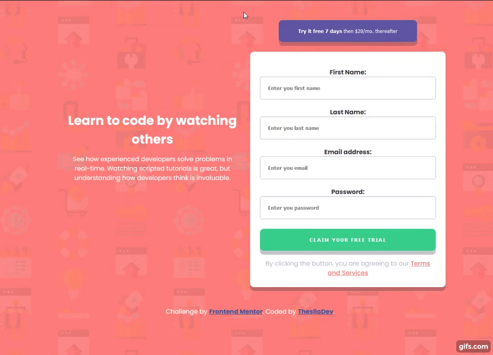

# Frontend Mentor - Intro component with sign up form solution
>  Site developed for studies and practices of HTML, CSS, JS

  
      

### Links:

[Access the site by clicking here](https://theslladev.github.io/Intro-component-with-signup-form/)
 | | 
[Challenge by Frontend Mentor](https://www.frontendmentor.io/challenges/intro-component-with-signup-form-5cf91bd49edda32581d28fd1)

---

## Welcome! 👋

Thanks for checking out this front-end coding challenge.

[Frontend Mentor](https://www.frontendmentor.io) challenges allow you to improve your skills in a real-life workflow.

**To do this challenge, you need a basic understanding of HTML, CSS and JavaScript.**

---

## The challenge

Your challenge is to build out this introductory component and get it looking as close to the design as possible.

You can use any tools you like to help you complete the challenge. So if you've got something you'd like to practice, feel free to give it a go.

Your users should be able to:

- View the optimal layout for the site depending on their device's screen size
- See hover states for all interactive elements on the page
- Receive an error message when the `form` is submitted if:
  - Any `input` field is empty. The message for this error should say *"[Field Name] cannot be empty"*
  - The email address is not formatted correctly (i.e. a correct email address should have this structure: `name@host.tld`). The message for this error should say *"Looks like this is not an email"*

Want some support on the challenge? [Join our Slack community](https://www.frontendmentor.io/slack) and ask questions in the **#help** channel.

---

### Applied technologies and knowledge:

- HTML
  - Accessibility
  - Best Practices
  - Events
  - Forms and validations
  - SEO
- CSS
  - Best Practices
  - CSS Variables
  - Flex Box
  - Mobile-first workflow
  - Responsive layout
  - Selectors
  - Transforms
- JS
  - DOM Manipulation
  - Events
  - Functions
  - Validation

- [FontAwesome](https://fontawesome.com/)
- [Google Fonts](https://fonts.google.com/)

---

## Giving feedback

Feedback is always welcome, so if you have any to give about this challenge, send a message on [Linkedin](https://www.linkedin.com/in/thalles-augusto)

This challenge is completely free. Share it with anyone who finds it useful for practice.

**Have fun building!** 🚀

### 👷 Author

<a href="https://github.com/ThesllaDev">
 
  
 <b>Thalles Augusto</b></a>

Made with ❤️ by Thalles Augusto 👋🏽 Contact me!  
  

---

### 📝 License

This project is under the [MIT](./LICENSE).